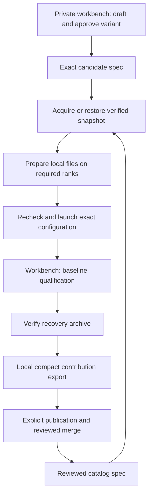

# Architecture

The public stack owns model files and serving. The private workbench uses
those same services to experiment with recipes and produce catalog
contributions. Operator serving and archive restoration require no private
workbench checkout.

## Contracts and ownership

`release_spec/` owns the canonical spec and snapshot manifest, normalization,
identity, recipe projection, and independent compact-evidence verification. The workbench imports
that module from its explicitly pinned stack checkout; it does not vendor a
second implementation. Qualification records exact workbench and stack commits.

A spec describes one exact model snapshot, image, recipe and hardware
geometry. The launch contract freezes its runtime arguments. Deployment
configuration can select placement, storage location, port and served name;
it cannot silently change the recipe. Mutable prerequisites are checked again
immediately before a serving action.

For multi-node recipes, `NCCL_IB_QPS_PER_CONNECTION` is normalized into
`identity.container_env`, defaulting to `4` for newly projected recipes. It
therefore participates in `spec_id` and runtime-contract identity. Offline mode,
logging, restart policy, health timing, NCCL debug level, and master port remain
deployment settings recorded in the launch plan. The plan and every container
also record the actual stack build; qualification observation requires those
labels to match.

The `model_library/` package owns structured storage records, planning and
node-local file verification. Thin Bash boundaries own confirmed topology,
control SSH, downloader invocation and transfer commands. There is no separate
Python lifecycle that bypasses these shared boundaries.

## Expected identity and physical files

Before the first candidate exists, acquisition verifies the complete upstream
Git/LFS inventory and derives a SHA-256 manifest from actual bytes. Once a
spec exists, acquisition additionally compares against its expected manifest.
Downloads remain in private same-filesystem staging until verification and
atomic publication without replacement complete.

An explicit home record says where a snapshot lives. A verification stamp
records metadata associated with a successful check. Neither record invents
file identity; the manifest supplies it. Prepared copies are associated with
their spec and job ranks. Pins preserve copies, while ownership and dependency
checks prevent deleting data used by another recipe or running container.

A foreground archive contains the complete snapshot and its manifest. The
reviewed spec supplies restoration identity after controller loss. The archive
shares model bytes across recipes and is independent of controller-local
placement records. Its configured path follows operator policy.

## Catalog observations and serving state

Catalog rows come only from schema-valid specs in `releases/`. Presence there is
the maintainer's catalog decision; `state` and `review` are nullable metadata,
not membership or serving gates. Rows combine any supplied review information
with saved observations of known managed files and archives. Reading the
catalog does not inspect arbitrary caches or contact serving nodes. Observation
age is explicit and unobserved state stays unknown.

Check now refreshes operational observations. Start independently rechecks
identity, recipe, geometry, image, capacity, placement and ownership. A previous
successful check does not authorize a later action. A live service observation
is separate from both catalog review and prepared-file state.

## Qualification and contribution

The workbench retains complete attempts and detailed diagnostics privately.
Baseline-v1 keeps six minimum checks: exact snapshot identity, serving smoke,
same-boot repeatability, pinned GSM8K accuracy, the 60-minute soak and required
performance measurements. Every participating node is checked before and after
measurement; missing nodes, altered contracts or restarts invalidate the run.

The workbench packages the spec and any measured evidence without assigning
catalog authority to the evidence. Explicitly requested publication opens a
contribution PR. Schema and filename checks gate catalog structure; evidence
verification and current launch compatibility are separate diagnostics. Their
results never add or remove membership. Deterministic evidence checks establish
document consistency only; physical execution claims still require maintainer
judgement.

The catalog starts empty, with no imported experiments or recipes. The deeper
`validated` suite is deferred. State and review metadata do not authorize or block serving;
operational prerequisites still apply.
