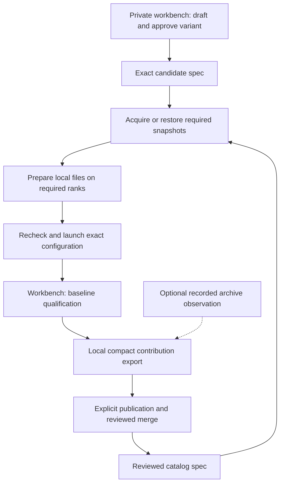

# Architecture

The public stack owns model files and serving. The private workbench uses
those same services to experiment with recipes and produce catalog
contributions. Operator serving and archive restoration require no private
workbench checkout.

## Contracts and ownership

`release_spec/` owns current serving specs, unchanged snapshot manifests,
normalization, identity, and canonical evidence verification. Workbench consumes
its behavior through the public `pulsar` CLI, never private imports or shell
sourcing. Compatibility is based on supported contracts, not Git equality.

Schema 2 freezes the exact model snapshot, image, engine arguments, container
settings, and geometry. Site configuration selects placement, storage locations,
ports, served names, and credentials. An explicit execution override produces a
new effective spec ID and is reported as a modified recipe; it does not inherit
the selected recipe's measurements or review metadata.

Both maintainer and catalog launches use the same spec compiler. It creates an
immutable private launch record and labels each container with selected/effective
spec IDs and that record's digest. Observation checks actual image, command,
environment, mounts, network/IPC/resource/device settings, health/restart policy,
and boot identity against the recorded effective configuration. It never compares
a container with the observing checkout's Git commit or mutable defaults.

[The public contract](CONTRACT.md) defines field bindings and CLI operations.
Baseline-v1 methods and thresholds remain unchanged. Measurements are separate
immutable runs bound to the effective spec. Tool commits and observed host/runtime
context describe the campaign; they do not define recipe identity.

The `model_library/` package owns structured storage records, planning and
node-local file verification. Thin Bash boundaries own confirmed topology,
control SSH, downloader invocation and transfer commands. There is no separate
Python lifecycle that bypasses these shared boundaries.

## Expected identity and physical files

Before the first candidate exists, acquisition verifies the complete upstream
Git/LFS inventory and derives a SHA-256 manifest from actual bytes. Once a
spec exists, acquisition additionally compares against its expected manifest.
Downloads remain in private same-filesystem staging until verification and
atomic publication without replacement complete.

An explicit home record says where a snapshot lives. A verification stamp
records metadata associated with a successful check. Neither record invents
file identity; the manifest supplies it. Prepared copies are associated with
their spec and job ranks. Pins preserve copies, while ownership and dependency
checks prevent deleting data used by another recipe or running container.

Prepared bindings may share a verified working copy on the same physical node.
The existing view records are the references; there is no separate reference
counter or content database. Copy selection matches the full snapshot manifest
and confirms the files before publishing the new spec/rank/topology binding.
The node serializes binding changes and last-reference deletion with its
lifecycle lock. Controller-only and node-only references both preserve storage
after interrupted publication. Shared records use private schema 3 with a
`binding_schema` of 1 or 2 to retain their original key layout. Converting all
owners before adding another binding makes older readers refuse the new
ownership semantics. This does not change serving-spec identity or the public
prepared-set envelope.

A foreground archive contains the complete snapshot and its manifest. The
reviewed spec supplies restoration identity after controller loss. The archive
shares model bytes across recipes and is independent of controller-local
placement records. Its configured path follows operator policy.

## Catalog observations and serving state

Catalog rows come only from schema-valid specs in `releases/`. Presence there is
the maintainer's catalog decision; `state` and `review` are nullable metadata,
not membership or serving gates. Rows combine any supplied review information
with saved observations of known managed files and archives. Reading the
catalog does not inspect arbitrary caches or contact serving nodes. Observation
age is explicit and unobserved state stays unknown.

Check now refreshes operational observations. Start independently rechecks
identity, recipe, geometry, image, capacity, placement and ownership. A previous
successful check does not authorize a later action. A live service observation
is separate from both catalog review and prepared-file state.

## Qualification and contribution

The workbench retains complete attempts and detailed diagnostics privately.
Baseline-v1 keeps six minimum checks: exact snapshot identity, serving smoke,
same-boot repeatability, pinned GSM8K accuracy, the 60-minute soak and required
performance measurements. Every participating node is checked before and after
measurement; missing nodes, altered contracts or restarts invalidate the run.

The workbench packages the spec and any measured evidence without assigning
catalog authority to the evidence. Explicitly requested publication opens a
contribution PR. Schema and filename checks gate catalog structure; evidence
verification and current launch compatibility are separate diagnostics. Their
results never add or remove membership. Deterministic evidence checks establish
document consistency only; physical execution claims still require maintainer
judgement.

The catalog starts empty, with no imported experiments or recipes. The deeper
`validated` suite is deferred. State and review metadata do not authorize or block serving;
operational prerequisites still apply.

Schema 3 extends the same lifecycle with named required snapshots while retaining
`recipe.model` as the target. A shared projection enumerates the complete set;
prepared-view keys include the snapshot manifest in their new record format.
Homes, transfers, verification, and archives continue operating per manifest.
Preparation plans and runtime checks cover the complete snapshot/rank matrix.
Speculative model references resolve through the existing container compiler.
The public CLI supports selecting an individual snapshot for acquisition,
archive creation, restoration, or home movement; complete-set integrity does
not depend on agent orchestration. See [the contract](CONTRACT.md#required-snapshots-and-speculative-decoding).
