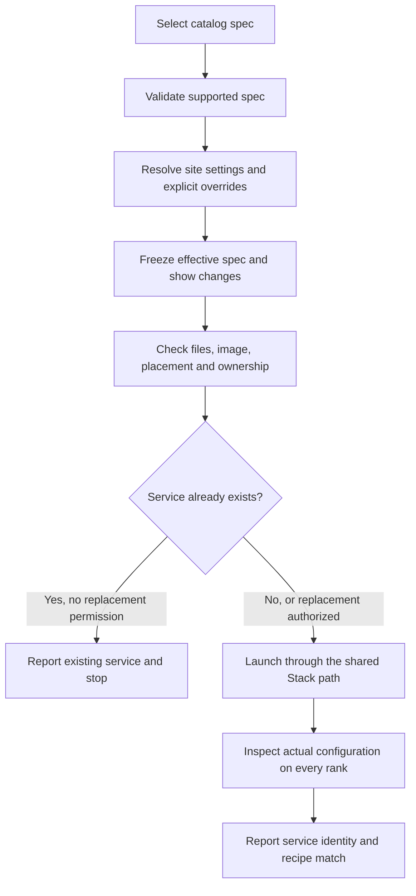

# Stack implementation plan: serve from the spec contract

Status: engineering handoff proposal, 2026-09-09. This document specifies future
behavior; it does not claim that the refactor or its validation has happened.
Implementation, physical experiments, commits, and publication are separate work.

## 1. Baseline and decisions

Use the complete local working tree as the implementation baseline, not the
remote default branch. At planning time Stack was on
`catalog-membership-and-workbench-contract`, commit
`017d5ccc097e20d2afd608dd3cb73f40b69118af`, with no tracked changes or untracked
non-ignored files before this planning task. This task adds this plan and the
terminology section in `AGENTS.md`. Preserve any subsequent unrelated changes.
Record a fresh status and diff before implementation; include dirty and untracked
source files in any integration snapshot. No test-suite pass is claimed here.

Maintainer decisions informing the plan:

- Stack is the only model acquisition, storage, placement, and serving backend.
  Workbench calls supported public CLI commands. There is no new network API,
  backend plugin system, third repository, or separately distributed library.
- A complete spec defines the recipe. Compatibility depends on supported
  contracts, not equality of Stack and Workbench Git commits.
- Make a clean break for future operations. Old records remain available for
  historical reading; do not migrate or relabel their evidence automatically.
- Operators may explicitly override execution settings. The effective recipe
  must be frozen, identifiable, observable, and clearly distinguished from the
  selected catalog recipe and its measurements.
- Use structured JSON drafts for the proposed agent-led authoring workflow.
  Agents present readable changes and obtain maintainer direction for variants.
- Catalog membership remains schema and filename based, with publication
  privacy checks. Measurements, review, and archive observations do not gate it.

This plan is the authority for the proposed shared CLI and spec changes. The
Workbench implementation plan must consume these interfaces rather than define
another schema or launcher. Changes to the handoff contract require updating
both plans before implementing dependent work.

## 2. Current coupling to remove

| Current boundary | Evidence in this checkout | Target |
| --- | --- | --- |
| Python callable advertised to Workbench | `scripts/integration_contract.py:recipe_projector` | Public commands and document versions |
| Spec converted to shell profile, then reconstructed | `scripts/release_consumer.py:spec_profile_variables`, `scripts/lib.sh:load_spec_profile`, `write_launch_plan_file` | Spec plus deployment settings directly becomes a launch plan |
| Launcher defaults supply missing recipe settings | `scripts/launch_plan.py:DEFAULT_RUNTIME`, `rank_docker_argv` | Explicit frozen container configuration |
| Commit label participates in acceptance | `scripts/runtime_binding.py:observe_rank`, `scripts/lib.sh:stack_build_revision` | Compare actual runtime configuration to the effective spec |
| Stack commit embedded in recipe contract | `release_spec/schema.py:LAUNCH_CONTRACT_KEYS`, `release_spec/run_record.py:verify_run_record` | Commits belong to measurement provenance |
| Derived recipe arguments and extra runtime ID repeat identity | `release_spec/identity.py:argv_from_identity`, `release_spec/__init__.py:runtime_contract_id` | One new spec ID binds the complete recipe |
| Measurement helpers require imports from this checkout | `release_spec/measurement.py`, `baseline_policy.py`, `baseline_evaluate.py` | CLI adapters around the canonical implementations |

Do not rewrite `model_library/`, SSH enrollment, locking, archive publication,
or the permission model to accomplish this boundary change.

## 3. Vocabulary

Apply the terminology rule in `AGENTS.md`. Use these meanings consistently.

| Term | Meaning |
| --- | --- |
| Draft | Editable JSON input; may be incomplete or invalid |
| Recipe | Frozen model identity, image, engine, geometry, and container settings |
| Spec | Versioned document containing a recipe and non-identity metadata |
| Spec ID | Content digest of the canonical recipe and spec schema version |
| Catalog spec | Spec selected from `releases/<spec_id>.json` |
| Effective spec | Spec actually selected for execution after explicit overrides |
| Deployment settings | Site choices: paths, addresses, placement, endpoint names, ports, credentials |
| Launch plan | Resolved intended action; never permission to perform it |
| Service | The owned group of containers implementing a spec on its required ranks |
| Observation | Actual inspected service configuration and state at a stated time |
| Measurement run | One measurement campaign, with its inputs, observations, and results |
| Commit | Git commit; qualify it as `stack_commit`, `workbench_commit`, or `model_commit` |
| Schema version | Version of a document format; never a Git commit |

Keep `release_spec/` and `releases/` as existing storage/module names in this
refactor. Do not perform a cosmetic filesystem rename. New public terminology
is `spec`; `pulsar release` is a deprecated human catalog alias, not a Workbench
integration surface. Label it deprecated in help, retain it through the first
CLI contract version, and remove it only at the next breaking CLI version.

## 4. Spec schema 2

Create a closed `pulsar-serving-spec` document with these top-level fields:

| Field | Required semantics |
| --- | --- |
| `schema_version` | Integer `2` |
| `kind` | `pulsar-serving-spec` |
| `spec_id` | SHA-256 of canonical `{schema_version: 2, recipe: ...}` |
| `recipe` | Closed structure below; all supported execution defaults explicit |
| `source` | Closed object `{image_repository: string}`; non-identity locator whose content must match the recipe digest |
| `state`, `review` | Nullable informational metadata, retaining existing allowed meanings |

Keep canonical JSON and decimal normalization in Stack. Supply golden vectors
for canonical bytes and IDs. Do not let Workbench calculate a competing spec ID.
Recipe arrays whose order affects execution retain that order. Environment keys,
resource-limit names, and other mathematical sets have canonical ordering.
Reject duplicate JSON keys, unknown fields, duplicate environment names, and
conflicting engine arguments. Do not ignore an unimplemented execution field.

`recipe` contains:

| Field | Definition |
| --- | --- |
| `model` | `model_id`, `model_commit`, and the complete `snapshot_manifest` |
| `image_digest` | Immutable image digest |
| `engine_args` | Existing normalized vLLM recipe arguments; geometry and site bindings may not be duplicated here |
| `container_env` | Explicit literal environment entries, including recipe-relevant former launcher defaults |
| `geometry` | Existing `platform_id`, `nodes`, `tp`, `pp`, `fabric` semantics |
| `container` | Explicit typed container settings, specified below |

Keep snapshot-manifest schema 1 and its existing hashing unchanged for storage
reuse. Its legacy `snapshot_revision` field means the model commit and must
equal `recipe.model.model_commit`. Do not rename persisted storage keys or
create duplicate model copies merely because the spec schema changes.

Remove `launch_contract.stack_version` and `launch_contract.argv` from new specs.
Do not add a replacement recipe commit field. Remove `launch_contract_id` from
new runtime observations and records: the complete spec ID binds that content.
Measurements become separate documents under the results layout in section 8,
not mutable additions to the recipe. Existing embedded measurements remain
available in the historical reader.

Implementation clarification: a run binds the recipe through `spec_id`, and
hashes the dataset and policy separately. Do not bind measurements to the raw
spec-file bytes: source locators and catalog review metadata are deliberately
outside recipe identity and may change without invalidating past measurements.

### Container fields and normalization

Use a closed structure, not arbitrary Docker argv or shell fragments:

| Field | Initial supported values and mapping |
| --- | --- |
| `network_mode` | `bridge` or `host`; bridge uses explicit port publishing |
| `ipc_mode` | `host` or `private` |
| `shm_size_bytes` | Positive integer when private IPC; null with host IPC |
| `ulimits` | Explicit named soft/hard limits; initially `memlock`, `stack`, `nofile`; `-1` means unlimited |
| `memory_limit_bytes` | Nonnegative integer; zero means no Docker memory cap |
| `cpu_limit_nanos` | Nonnegative integer; zero means no Docker CPU quota |
| `accelerator_access` | `all` for the currently supported single-accelerator-per-node platform |
| `devices` | Portable required-device identifiers; initially `infiniband` maps to the existing device exposure |
| `restart_policy` | `no`, `always`, `unless-stopped`, or `on-failure`; retry count is explicit for `on-failure` |
| `healthcheck` | Null, or HTTP path plus explicit interval, timeout, retries, and start period |

The first implementation must preserve the current one-node and multi-node
defaults in generated draft examples: current networking and IPC choices,
existing memlock/stack limits, healthcheck behavior, and environment defaults.
Do not switch networking to host mode as part of the refactor. For settings
currently inherited rather than explicitly supplied, the example must identify
the missing value; freezing requires an explicit value instead of inventing a
measurement. Only enforce listed ulimit requirements; capture other inherited
limits in observation context. Inherited context is not claimed to be frozen.

Before coding the schema, create a field-by-field inventory of every argument
emitted by the current `rank_docker_argv`. Classify each as recipe, site binding,
or lifecycle mechanics. The inventory is a required review artifact. Container
name, detach mode, ownership labels, and authentication secrets are mechanics
or site bindings, not recipe identity. The current rank-address, fabric-device,
control-interface, model-path, served-name, and port substitutions are a fixed,
documented binding rule in CLI contract 1; do not introduce a general template
language. Frozen literal environment values may not override reserved bindings.
Any extra execution-affecting flag must receive an explicit contract treatment
before the inventory is accepted. Do not silently classify it as provenance.

Record actual driver/runtime/kernel versions and relevant host resource context
with measurements. A portable recipe does not promise identical timing across
all hosts. Do not turn every observed host fact into a launch constraint.

## 5. Operator overrides and service identity

Add `--override-file FILE` to `pulsar start` and its dry-run path. The file is a
closed partial object over `recipe.engine_args`, `recipe.container_env`, and
`recipe.container`. Arrays replace the entire array; object fields merge by
name; null is valid only where the full schema allows it. Reject every other
key, including model, image, and geometry changes. Those require selecting or
authoring another spec. This preserves the explicitly requested container
override use case without an unrestricted Docker escape hatch.

1. Validate the selected catalog/candidate spec.
2. Apply the explicit override and validate/canonicalize the complete recipe.
3. Calculate the effective spec ID with the same schema-2 algorithm.
4. Persist the effective spec and resolved launch plan atomically in private
   Stack state before launch. Neither operation publishes a catalog entry.
5. Display selected spec ID, effective spec ID, and field-level changes before
   a mutation. Noninteractive use still requires the applicable explicit flags.
6. If IDs differ, label human output `Modified recipe` and JSON
   `matches_selected_spec: false`. Show selected-recipe measurements only as
   reference; do not attribute them to the modified recipe.

A no-op override leaves identity and classification unchanged. Site-only
settings leave the spec ID unchanged but appear in the private observations.
When an override changes the effective identity, initialize its `state` and
`review` to null. Do not copy a selected recipe's measurement/review metadata
onto the derived recipe. Display the selected catalog metadata separately.

Use `selected_spec_id` and `spec_id` (the effective identity) in new records.
Use new container labels `io.pulsar.gb10.selected-spec-id` and
`io.pulsar.gb10.spec-id`; retain the ownership/rank/topology labels needed for
safe lifecycle operations. Do not write or require a stack-commit label.

Keep the existing limit of one managed service per selected spec and placement;
do not add a multi-deployment feature. Existing start/stop/status selection by
selected spec remains understandable for the operator. Return an opaque
`service_id` so Workbench can bind observations to the exact launched group.
Changing overrides on an existing service requires explicit replacement;
neither `--yes` nor an override file grants `--replace` or `--pull-image`.

### Operator workflow

Acquisition, restore, and prepare remain explicit existing actions. This chart
does not authorize downloading, replacing, or repairing prerequisites silently.
Gum and plain menus must use the same path and show the same recipe distinction.

## 6. Public CLI contract 1

`pulsar` is the only cross-repository executable entrypoint. Extend its dispatch
to existing implementations rather than add another orchestration layer.
Use subprocess argument arrays. Commands never require the caller's working
directory to be this repository. Document paths and environment inputs publicly.

All commands below except resource streams support `--json`. For that mode,
stdout is one JSON object: `{schema_version: 1, ok: true, result: ...}` or
`{schema_version: 1, ok: false, error: {code, message, details}}`. Diagnostics go
to stderr. Exit 0 means success; 2 invalid input/unsupported contract; 3 an
operational prerequisite or ownership mismatch; 1 other execution failure.
`details` is an array of field/action-specific diagnostics. Errors must not
include secrets. No human-text parsing is part of the contract.

| Command | Contract / effect |
| --- | --- |
| `pulsar contract --json` | No topology or clean-tree requirement. Return supported CLI, draft, spec, observation, measurement, and run-record versions; supported operations; policy digests; optional producer commit metadata |
| `pulsar spec example --nodes N --json` | Return a documented draft example with explicit defaults and missing required inputs |
| `pulsar spec freeze --draft FILE --manifest FILE --json` | Validate draft and complete source manifest; return canonical schema-2 spec plus readable field diagnostics on failure; no service or catalog mutation |
| `pulsar spec verify --file FILE --json` | Validate a new spec and return its canonical document; no topology required |
| `pulsar spec compare --before FILE --after FILE --json` | Return recipe field changes and whether spec IDs differ |
| `pulsar spec show --file FILE --historical --json` | Read supported historical/new specs; historical mode cannot create a launchable spec |
| `pulsar model ... --json` | Stabilize existing acquire/prepare/info/restore/archive commands and their result envelopes; keep current explicit action permissions |
| `pulsar start SPEC [--spec-file FILE] [--override-file FILE] --json` | Use the shared execution path and return selected/effective IDs, service ID, and actual launch outcome; preserve existing explicit flags |
| `pulsar observe --service-id ID --json` | Full current-spec observation, including verified model bytes and effective container configuration on every rank; no mutation |
| `pulsar resources --service-id ID --interval SECONDS --jsonl` | Explicit private telemetry stream using Stack-owned placement and transport; no full model hashing on every sample |
| `pulsar resources --spec-file FILE [--node NODE] [--override-file FILE] --interval SECONDS --jsonl` | Approved cold-start mode: sample confirmed nodes before launch, then attach only to the matching owned container; no preparation or launch |
| `pulsar stop SPEC --json`, `pulsar status SPEC --json` | Retain operator selectors, ownership checks, and structured outputs; status includes selected/effective IDs |
| `pulsar policy show baseline-v1 --json` | Return the canonical policy, digest, and existing measurement parameters without reading private state |
| `pulsar evidence measurement --operation OP --input FILE --out FILE --json` | Build and validate the canonical compact measurement from one producer payload using existing normalizers; one call per completed producer, not per request |
| `pulsar evidence evaluate --spec-file FILE --policy-file FILE --measurements-dir DIR --out DIR --json` | Evaluate existing thresholds and produce compact results; cannot launch or require a passing result for catalog membership |
| `pulsar evidence verify --spec-file FILE --run FILE --evidence-root DIR --json` | Validate document consistency, including failed/incomplete runs; report evaluation outcome separately |
| `pulsar evidence summary --spec-file FILE --run FILE [--archive-observation FILE] --json` | Return an evidence summary with explicit missing information; archive availability does not determine the measurement result |
| `pulsar privacy check --root DIR [--staged] --json` | Public entrypoint for the existing publication scanner |
| `pulsar contribution verify --package DIR --json` | Validate schema, exact paths/hashes, and publication privacy without requiring evidence or archive success |
| `pulsar selftest` | Public adapter for the existing required repository checks |

Existing topology/SSH/configuration commands remain public. Give Workbench a
documented `pulsar topology detect --json` path instead of direct access to
`scripts/detect-fabric.sh`. Keep detect/check/save/enroll authorities distinct.

Add fixture documents specifying complete request/result fields for every
operation above before Workbench switches to it. Reuse current data schemas
where their semantics are unchanged; the new envelope must not hide a second
version of those schemas. No command is considered ready merely because it
exists in `contract` output: it must pass its contract fixtures.

Resource streams begin with a versioned header identifying the service and
sampling interval, then timestamped rank samples. Sampling failures are explicit
records, never zeros. EOF/termination stops only the diagnostic process and its
owned children, never the service. Preserve the current monitor's cadence,
collection metrics, and aggregate interpretation. Move node-local collection
and transport to Stack; Workbench retains analysis and private retention.

Workbench reads its own explicitly configured credential references/environment
for HTTP measurements. Stack returns a private endpoint and served model name,
never credentials. Do not source Stack `.env` or shell libraries in Workbench.

## 7. Launch and observation implementation

Create one Python projection from `(effective spec, deployment settings,
verified prepared set)` to a launch plan. Both one-node and multi-node Bash
launchers consume it; Bash still owns locks, SSH, and process execution.

Remove the selected-spec -> shell profile -> reconstructed recipe round trip.
Extract only placement/storage facts needed by the existing Bash boundary.
Do not retain `ENGINE_ARGS`/`CONTAINER_ENV` as an independent mutable authority
after a spec is selected. Reject legacy override environment variables with a
message pointing to the explicit override file.

One normalization module produces expected container settings and normalizes
Docker inspect data. Compare:

- Effective spec ID and ownership/selected-spec/rank/topology labels.
- Pinned actual image digest, entrypoint, command, and resolved environment.
- Verified model mounts, read-only access, and absence of shadowing mounts.
- Network mode/port bindings, IPC/shared memory, supported ulimits, CPU/memory
  limits, accelerator/device requests, restart policy, and healthcheck.
- Exact required rank coverage and running state; per-rank boot witness from
  immutable container ID and start time.

Normalize Docker's equivalent defaults before comparison; put equivalences in
golden inspect fixtures. Never compare raw unordered inspect JSON. Protect the
stored effective spec/plan with the existing private atomic I/O conventions.
Missing/corrupt state produces a clear diagnostic; do not reconstruct it from
the current checkout's defaults or claim a complete new-contract observation.

Observe against the stored effective spec and the caller's expected spec ID,
not a newly generated plan from mutable site settings. Record site/environment
context separately from identity. A changed Stack checkout alone must neither
invalidate the observation nor restart a service. A real mismatch blocks a
claim of matching observations, not continued operation of an untouched service.

## 8. Measurement evidence and historical records

New observation schema 2 must include: kind/schema version, observation time,
service ID, selected and effective spec IDs, match classification, canonical
effective recipe, private endpoint/served name, and an ordered rank list. Each
rank has image/manifest identity, boot witness, verification result, normalized
container configuration, and observed host/runtime context. Private host values
are excluded from compact public evidence by an explicit allowlist projection.

New run-record schema 3 binds the effective spec ID, measurement policy digest,
measurement input hashes, before/after rank boot/configuration observations,
measurement hashes, outcome, and producer provenance. Use `workbench_commit`
and `stack_commit`; do not compare either with a recipe field or launch label.
Distinguish the observer's Stack commit from any optional historical launch
producer metadata. A commit is not proof of actual runtime configuration.
Record observer provenance separately for before/after observations. Unavailable
Stack commit metadata is null with an explicit provenance limitation; it does
not by itself make an otherwise valid measurement fail. No clean Git checkout
or Stack commit is a prerequisite for the public observation/document APIs.

Public layout: `releases/<spec_id>.json` and optional
`results/baseline-v1/<spec_id>/<run_id>/...`. A `run_id` identifies one immutable
campaign, permitting later measurements without replacing earlier evidence.
Run IDs are not recipe identities. Re-publishing an identical spec may add a
new run directory; conflicting recipe content at an existing ID is an error.
Metadata changes require an explicit reviewed change, not an export side effect.

Historical support is deliberately narrow:

- A read-only reader verifies/displays old schema-1 specs and schema-2 runs under
  their original rules and names. It cannot convert them into new measurements.
- New start/prepare/qualify/publication paths require the new contract. Show a
  direct unsupported-schema diagnostic for old artifacts. Do not preserve a
  legacy launch compiler or generate new IDs automatically for old records.
- Preserve existing services and model/archive bytes. Inventory, status, and
  safe stop retain recognition of old ownership labels; full new-contract
  observation may be unavailable and must say why.
- Old catalog files remain available for history and are displayed as historical;
  do not delete them or treat unsupported launch schema as evidence failure.
  Catalog structural validation accepts historical files already present, while
  new/changed contributions must use schema 2. Test this distinction explicitly.
- Starting a new-contract equivalent requires an explicitly authored spec and
  normal replacement authority. Reuse verified model bytes by the unchanged
  manifest identity. New measurements require a new run; never relabel old runs.

## 9. Work packages and sequencing

| Package | Files / responsibility | Done when |
| --- | --- | --- |
| S1: contract fixtures | `docs/`, `tests/fixtures/contracts/`, `scripts/integration_contract.py` | Field inventory, canonical examples, errors, and CLI request/results reviewed; no private implementation references advertised |
| S2: spec and history | `release_spec/schema.py`, `identity.py`, `verify.py`, `recipe.py`, `run_record.py`, `cli.py`; new schema-specific modules as needed | Schema 2 freezes container settings, removes commit/derived-argv identity, has golden IDs; historical reader cannot enable new operations |
| S3: direct execution | `scripts/release_consumer.py`, `lib.sh`, `launch_plan.py`, `serve.sh`, `cluster/start-cluster.sh`, `up.sh`, overlay loader | Both launch paths use one effective-spec compiler; typed overrides and provenance are persisted; no recipe reconstruction through shell variables |
| S4: actual observations | `scripts/runtime_binding.py`, `observe-serving.sh`, inventory/status adapters; resource sampler adapter | Full container configuration checked; no commit equality; old services inspectable/stoppable; resource collection uses Stack transport |
| S5: public document commands | `pulsar`, new thin CLI adapter(s), `release_spec/measurement.py`, policy/evaluator/contribution code | All section-6 contracts pass fixtures; no topology is required for pure document commands |
| S6: operator and publication flow | menu/help/catalog renderers, contribution/privacy wrappers, tests | Modified recipes visible in CLI/Gum/plain output; no measurement misattribution; new-run append and historical catalog rules work |
| S7: delete obsolete paths | legacy profile projection/aliases, stack-build production and checks, docs/skills | No active new-contract path depends on removed semantics; terminology and all operator guidance match implementation |

Implement S1/S2 first. S3/S4 must pass together before a real service uses the new
contract. S5 enables Workbench integration. S6/S7 complete the handoff. Keep
intermediate work isolated if it cannot satisfy the full local selftest; do not
publish an intermediate breaking state as ready for operators.

Update `AGENTS.md`, `docs/ARCHITECTURE.md`, `OPERATIONS.md`, `CONTRIBUTIONS.md`,
`DECISIONS.md`, relevant skills and catalog/results READMEs with the actual final
behavior. Explicitly supersede the current commit-label rule and shell-profile
projection descriptions. Do not rewrite historical decision/evidence records.

## 10. Verification and acceptance

Run focused `release_spec` and affected Python tests, Bash syntax checks,
`shellcheck --severity=error` for affected scripts, and the full
`scripts/selftest.sh` before commit/publication. Capture baseline failures before
changes and report them separately; do not claim old failures were fixed by this
plan. Screen working-tree and staged publication content with existing scanners.

Required behavior tests:

1. Candidate-file and catalog-file inputs produce identical execution settings
   for the same spec/site inputs, on one and multiple ranks.
2. Every supported recipe field affects canonical identity; source locator,
   state/review, and site bindings do not. Duplicates/unknown fields fail.
3. Explicit container overrides produce a new effective spec ID and accurate
   differences; no-op overrides do not. Existing services require replacement
   permission, and no override implicitly pulls an image.
4. Each observed configuration dimension in section 7 has a meaningful mismatch
   fixture. Recipe mismatch, missing ranks, wrong files, and changed boot are
   detected independently of labels and commits.
5. Two compatible Stack commits observe the same unchanged container without
   replacement. A docs-only update neither changes its recipe nor invalidates it.
6. Old services remain inspectable/stoppable; old records remain readable; new
   operations on old specs fail clearly without mutation or evidence rewriting.
7. Pure document commands work without topology, SSH, model files, Docker, or a
   clean working tree. Resource sampling is not part of ordinary serving.
8. A fake CLI consumer needs only executable path and documented JSON; no
   imports, Stack directory traversal, or human-text parsing.
9. Missing/failed evidence and missing archives do not prevent a schema-valid
   new contribution. Privacy, exact filename, and identity checks remain enforced.
10. Public compact evidence contains no private endpoints, host identifiers,
    paths, credentials, or raw inspect dumps.

Use recorded/synthetic inspect fixtures for deterministic tests. A separately
authorized physical acceptance run must demonstrate new-spec launch, actual
configuration capture, unchanged-service observation from another compatible
checkout, and explicit override handling. One-node evidence does not establish
multi-node correctness. Do not mix a host-networking performance experiment or
an image/recipe optimization into this refactor's acceptance run.

Completion requires removal of the old coupling paths, not merely new wrappers
around still-imported private code. Report deleted paths, remaining historical
readers, contract fixtures, full test results, and physical evidence limitations.

## 11. Review checkpoints and limits on scope

This plan deliberately spends complexity on the complete runtime contract and
removes it from duplicate representations, commit gating, and private integration.
It does not promise that the first schema/CLI commit reduces total line count.
Measure the result by removed authorities and usable workflows, not wrapper count.

Before implementation expands, review the S1 field inventory and API fixtures
with the counterpart engineer. Routine type/serialization choices belong to the
engineer; stop for maintainer direction if an unclassified runtime setting would
change recipe identity, require a new deployment constraint, remove an operator
capability, alter baseline criteria, or require mutating historical data/services.
Do not add support for arbitrary Docker flags, new hardware geometry, extra
backends, CPU placement policy, or remote RPC as an incidental convenience.

The clean break sacrifices direct operational reuse of old specs to avoid a
second launcher/compiler. The retained historical reader and ownership-based
stop/status path are intentional limits, not a partially implemented migration.
Revisit that choice with the maintainer if actual catalog adoption needs a
legacy execution bridge; do not quietly build one.
